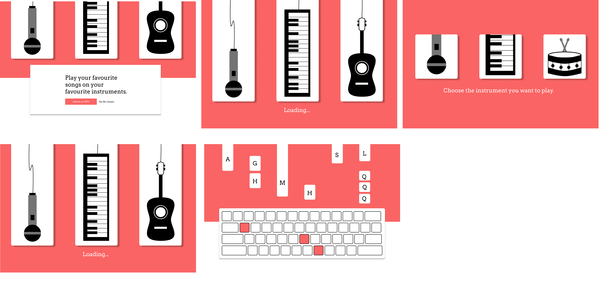

# Sharp Tune
Hack The North 2021 Submission

The project is stil a work in progress. It is a music game that converts any musical mp3 file into separate instruments that are then to be played by the user.
## Running the Project
### Installing the Dependencies
Run the `npm run dep-install` command
### Running the Server
Run the `npm run server` command. The server will be listening on port 4000.
### Running the Client
Run the `npm run client` command. The client server will be listening on port 3000. The client will require `yarn`.
### Running Both
Run the `npm run start` command. The server will be listening on port 4000 and the client server will be listening on port 3000. The client will require `yarn`.
## How it will Work
The web app would allow users to upload an mp3 file of their choice. The app would then attempt to split all the separate components (intruments + vocals) into separate files. Once the components get separated, the user gets the chance to pick which intrument they want to play or if they want to do vocals.

The notes of the selected instrument would then be mapped to different keys on the computer keyboard that the user would have to follow along with. This would be done with the help of sonicAPI.

The vocals would be matched with the help of voice recognition software.

## Routes
| Method | Route        | Description              |
|--------|--------------|--------------------------|
| GET    | /loading     | Loading screen           |
| GET    | /instruments | Instrument select screen |
| GET    | /keyboard    | Keyboard screen          |

## What the Flow Would Look Like

## Challenges
It is very challenging to find a way to convert an audio file to MIDI and/or other formats that help with note/chord conversion. Most APIs are paywalled, and development of these kinds of APIs require a lot of research. As such, a lot of development time was allocated to API research.
